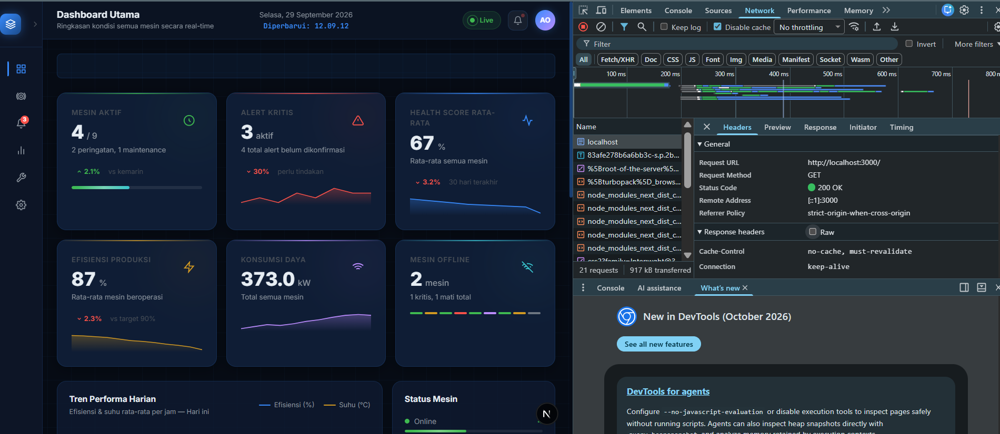
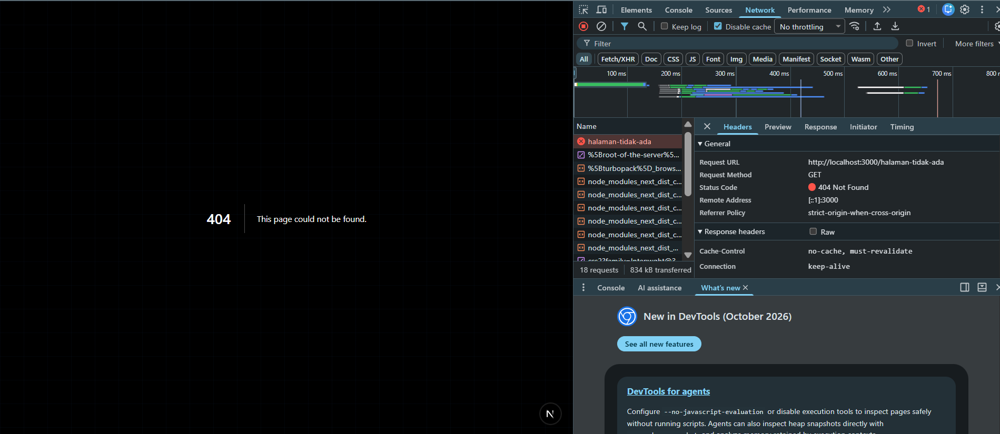
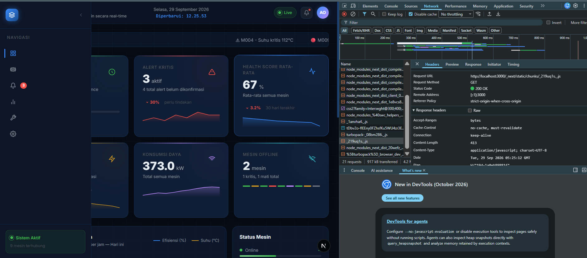
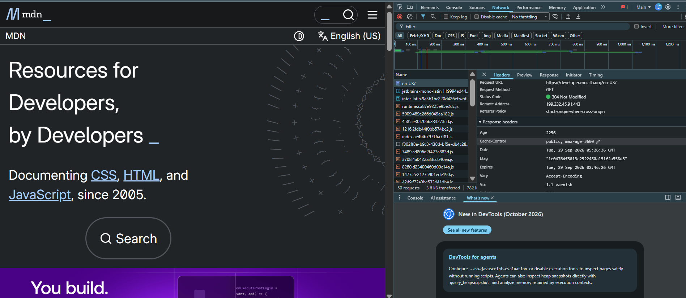

# Dokumen Teknis Modul 1 — Lingkungan Pengembangan, Git, dan Lalu Lintas HTTP

Nama   : Razqa Azaki
NIM    : 105224046

---

## 1. Lingkungan Pengembangan

| Perangkat Lunak    | Versi                    |
|--------------------|--------------------------|
| Sistem Operasi     | Windows 11 Version 25H2  |
| Node.js            | v24.21.0                 |
| npm                | 11.19.0                  |
| Git                | 2.55.0.windows.3         |
| Visual Studio Code | 1.139.0                  |

---

## 2. Alur Kerja Git

### Keluaran git log --oneline --graph

```
PS C:\Users\ASUS\Documents\Kuliah Computer Science\Semester 5\Praktikum Pengembangan Website\razqa-tech> git log --oneline --graph --all
*   f647960 (HEAD -> main, origin/docs/readme-lengkap, latihan/konflik) menyelesaikan konflik deskripsi produk
|\
| * e0eaf8e menambahkan deskripsi produk pada README
* | bfe1a75 mengubah deskripsi produk       
|/
*   c19dd56 (origin/main, origin/HEAD) Merge branch 'modul-1'
|\
| | * 4964dd5 (latihan-modul-1) commit razqa
| |/|
| |/
|/|
* | ea0ace1 Initial commit from Create Next App
 /
* ef8f7f7 (origin/modul-1, origin/latihan-modul-1, modul-1) commit baru
```

### Tautan Pull Request yang Telah Digabungkan

[https://github.com/razqaazakii/praktikum-website-Razqa/pull/1] 

### Konflik yang Terjadi

| Poin | Keterangan |
|------|------------|
| File yang konflik | `README.md` |
| Penyebab | Baris deskripsi diedit berbeda di branch `main` dan `latihan/konflik`. Di main diubah menjadi "Aplikasi web untuk monitoring performa mesin industri secara langsung", di latihan/konflik menjadi "Aplikasi web dashboard untuk memantau kondisi mesin di lingkungan industri secara real-time" |
| Cara penyelesaian | Konflik diselesaikan secara manual di VS Code dengan memilih opsi Accept Current Change, lalu menjalankan git add README.md dan git commit |
| Alasan pemilihan isi akhir | Memilih versi branch main karena deskripsi lebih ringkas dan langsung menjelaskan fungsi utama aplikasi |

---

## 3. Pengamatan Lalu Lintas HTTP

### Tabel Kerja Pengamatan

| No | URL | Metode | Kode Status | Content-Type | Header Lain yang Diamati |
|----|-----|--------|-------------|--------------|--------------------------|
| 1 | http://localhost:3000/ | GET | 200 OK | text/html; charset=utf-8 | Cache-Control: no-cache, must-revalidate |
| 2 | http://localhost:3000/halaman-tidak-ada | GET | 404 Not Found | text/html; charset=utf-8 | Cache-Control: no-cache, must-revalidate |
| 3 | http://localhost:3000/_next/static/chunks/_219uq1s_.js | GET | 200 OK | application/javascript; charset=UTF-8 | Cache-Control: no-cache, must-revalidate |
| 4 | http://github.com (curl) | HEAD | 301 Moved Permanently | - | Location: https://github.com/ |
| 5 | https://developer.mozilla.org (dengan cache) | GET | 304 Not Modified | - | Cache-Control: public, max-age=3600 |

### Screenshot Layar DevTools

**Status 200 — localhost:3000**


**Status 404 — localhost:3000/halaman-tidak-ada**


**Status 200 — File JS dari localhost**


**Status 304 — developer.mozilla.org dengan cache**


### Keluaran curl -I dan curl -v

**curl -I http://localhost:3000**
```
HTTP/1.1 200 OK
Content-Type: text/html; charset=utf-8
Cache-Control: no-cache, must-revalidate
X-Powered-By: Next.js
Date: Tue, 29 Sep 2026 05:52:46 GMT
Connection: keep-alive
```

**curl -I http://github.com**
```
HTTP/1.1 301 Moved Permanently
Content-Length: 0
Location: https://github.com/
```

**curl -v https://example.com**
```
> GET / HTTP/1.1
> Host: example.com
> User-Agent: curl/8.21.0
> Accept: */*
>
< HTTP/1.1 200 OK
< Content-Type: text/html; charset=utf-8
< Server: cloudflare
< last-modified: Mon, 28 Sep 2026 16:19:32 GMT
< cf-cache-status: HIT
< CF-RAY: a428b9a4c95de60e-SIN
```

### Analisis

**a. Perbedaan status dan ukuran antara pemuatan dengan dan tanpa cache**

Saat pertama kali mengakses web status 200, browser harus mengunduh seluruh data dari server sehingga membutuhkan waktu lebih lama. Sedangkan saat web dibuka kembali status 304, browser cukup menggunakan data yang sudah tersimpan di perangkat Anda cache tanpa mengunduh ulang 0 Byte, sehingga halaman terbuka jauh lebih cepat.

**b. Alasan metode curl -I adalah HEAD**

Metode curl `-I` secara otomatis mengubah method dari GET menjadi HEAD sehingga server hanya mengirim header respons tanpa body, menghemat bandwidth karena isi halaman tidak perlu diunduh sama sekali.

**c. Alasan http://github.com dialihkan**

GitHub menerapkan kebijakan HTTPS wajib sehingga setiap permintaan HTTP dikembalikan dengan status 301 Moved Permanently beserta header Location yang mengarahkan ke `https://github.com` demi keamanan enkripsi data.

---

## 4. Kendala dan Penyelesaian

| No | Kendala | Penyelesaian |
|----|---------|--------------|
| 1 | Perintah `touch` tidak dikenali di Windows PowerShell | Menggunakan perintah `New-Item` sebagai pengganti untuk membuat file baru |
| 2 | Perintah `curl` di PowerShell mengarah ke `Invoke-WebRequest` bukan curl asli | Menggunakan `curl.exe` agar yang dijalankan adalah program curl yang sebenarnya |
| 3 | Kesulitan membaca header pada keluaran curl -v karena tertutup kode HTML yang panjang | Menggunakan `curl -I` terlebih dahulu untuk melihat header saja, lalu `curl -v` untuk detail lengkap |

---

## 5. Catatan Pemanfaatan AI

| Alat AI | Perintah Utama | Bagian yang Digunakan | Cara Memverifikasi |
|---------|----------------|----------------------|-------------------|
| Claude | Meminta pembuatan template Markdown dan menjelaskan git | Struktur dokumen dan penjelasan konflik Git | Membandingkan output terminal dan DevTools secara langsung dengan penjelasan yang diberikan AI | 
| Claude & Gemini | Mencari solusi error curl di PowerShell dan penjelasan cara kerja curl -I | Pengamatan Lalu Lintas HTTP | Mencocokkan hasil keluaran terminal curl secara mandiri dengan penjelasan AI |
| Claude | Meminta penjelasan cara kerja dan perbedaan perintah `curl -I` dan `curl -v` | Kendala dan penyelesaian |  Mencocokkan hasil keluaran terminal curl seperti contoh yang ada di website atau google |  